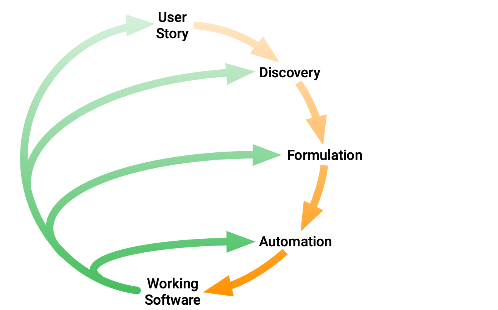

* Behaviour-Driven Development (BDD)
  * := software development process
  * Cucumber support it

# What is BDD?

* allows
  * closing the gap between business people -- and -- technical people
  * encouraging collaboration across roles
  * working in rapid, small iterations to increase feedback
  * producing system documentation / 
    * -- is automatically checked against the -- system's behaviour
    * ⭐enables you to continue confidently ⭐
      * Reason: 🧠code -- reflects the -- documentation, & the documentation -- reflects the -- team's shared understanding  🧠
  * guiding from concept -- through to -- implementation

## BDD and agile

* BDD 
  * does NOT replace your existing agile process, BUT it enhances it
  * == set of plugins | your existing process

# Day-to-day BDD activity: _Discovery_, _Formulation_, and _Automation_

* Day-to-day BDD activity steps
  1. Discovery. if a [User Story] comes -> agreed on
     1. concrete examples
     2. expected outcomes / behaviors
  2. Formulation. document those examples / -- can be --
     1. automated
     2. checked for agreement
  3. Automation. implement the behaviour / documented example

* goal
  * each change is small
  * iterate rapidly

<figure>
  
  <figcaption>Discovery, Formulation and Automation</figcaption>
</figure> 

## Discovery: What it _could_ do

* allows
  * minimising time spent in meetings
  * maximising the valuable code / you produce
  * following structured conversations -- [discovery workshops] -- 
    * revealing
      * gaps in our understanding
      * low-priority functionality

## Formulation: What it _should_ do

* TODO:
As soon as we have identified at least one valuable example from our discovery sessions, we can now formulate each example as structured documentation. This gives us a quick way to confirm that we really do have a shared understanding of what to build.

In contrast to traditional documentation, we use [a medium that can be read by both humans and computers](../gherkin), so that:

* We can get feedback from the whole team about our shared vision of what we're building.
* We'll be able to automate these examples to guide our development of the implementation.

By writing this executable specification collaboratively, we establish a shared language for talking about the system. This helps us to use problem-domain terminology all the way down into the code.

## Automation: What it _actually does_

Now that we have our executable specification, we can use it to guide our development of the implementation.

Taking one example at a time, we automate it by connecting it to the system as a test. The test fails because we have not implemented the behaviour it describes yet. Now we develop the implementation code, using [lower-level examples of the behaviour of internal system components](https://anarchycreek.com/2009/05/20/theyre-called-microtests/) to guide us as required.

The automated examples work like guide-rails, helping us to keep our development work on track.

When we need to come back and maintain the system later, the automated examples will help us to understand what the system is currently doing, and to make changes safely without unintentionally breaking anything.

This rapid, repeatable feedback reduces the burden of manual regression testing, freeing people up to do more interesting work, like exploratory testing.

# Learn more

Read the topics below to dig deeper and learn more about BDD.

[discovery workshops]: /docs/bdd/discovery-workshop/
[User Story]: /docs/terms/user-story/
[User Stories]: /docs/terms/user-story/
